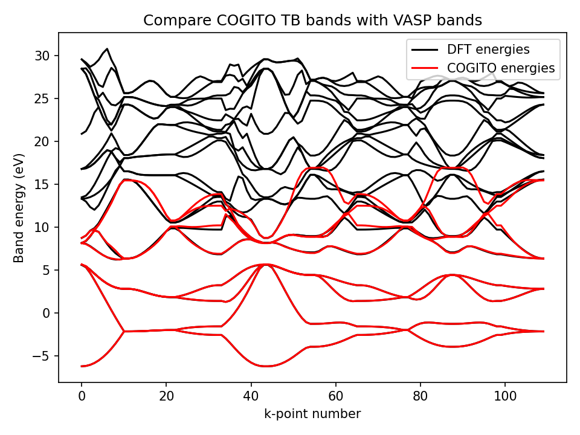
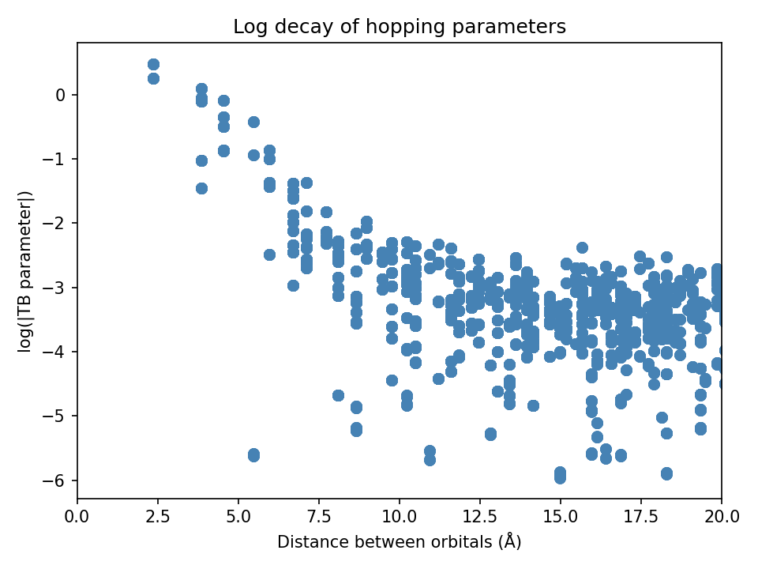
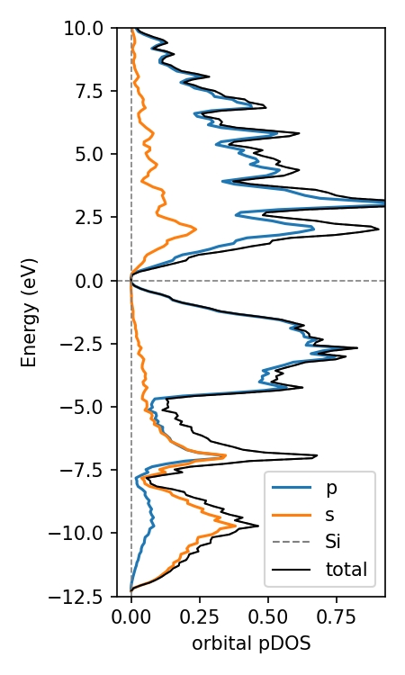
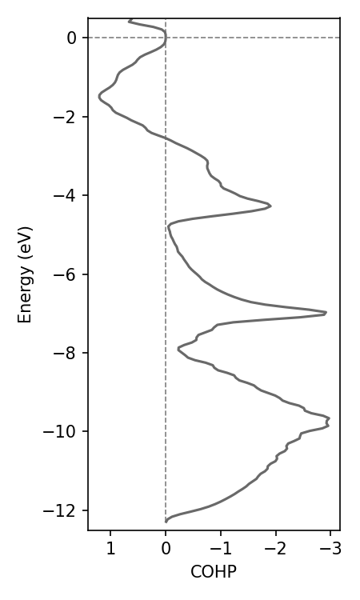

# COGITO - Home
<p class="page-subtitle">Quantum chemical bonding from plane-wave DFT</p>

## Welcome to COGITO!

Crystal Orbital Guided Iteration To atomic-Orbitals (COGITO) is a tool for obtaining quantum chemistry from plane wave DFT calculations. The code maps the plane wave basis to our COGITO basis. With this we can trace back which bonds are contributing to the independent particle energies. Leverging this, we can plot the crystal structure with their actual quantum chemical covalent bonds, determine origins of electronic structure, charge transfer, and more!

Observe the bonding in the α-PbO structure by hovering over the bond lines. Solid lines indicate bonding while dashed lines indictate antibonding. The width of the line is proprotional to the magnitude of the bond energy.

<div style="display: flex; justify-content: center;">
    <div class="image-container" style="height: 450px; width: 500px; background-color: transparent;">
        <iframe src="PbO/crystal_bonds.html" style="transform: scale(0.70)  translate(-90px, -100px); transform-origin: top left; width: 175%; height: 175%; border: 0;"></iframe>
    </div>
</div>

<br>

::::{grid} 3

:::{grid-item-card} Tutorial
:link: tutorial
:link-type: doc

Overview of installation and workflow. Short examples of key features.
:::

:::{grid-item-card} Inputs/outputs guide
:link: file_struc
:link-type: doc

Compressive guide of inputs and outputs to COGITO modules.
:::

:::{grid-item-card} API
:link: api_ref
:link-type: doc

Complete documentation of COGITO modules. 
:::

::::

<br>

## Quick Guide

Click images for detailed tutorials or use the links below to jump directly to API documentation.

### Verify quality of COGITO run

<div style="display: flex; justify-content: space-around;">
    <div class="image-container" style="height: 100%;">
        <a href="tutorial.html#comparedft">
            
            <div class="overlay-text">Compare COGITO bands<br>to VASP</div>
        </a>
    </div>
    <div class="image-container" style="height: 100%;">
        <a href="tutorial.html#tight">
            
            <div class="overlay-text">Plot parameter decay</div>
        </a>
    </div>
</div>

### Plot with band structure k-grid

<div style="display: flex; justify-content: space-around;">
    <div class="image-container" style="height: 300px;">
        <a href="tutorial.html#cohpbs">
            <iframe src="Si/COHP_BS.html" style="transform: scale(0.5); transform-origin: top left; width: 200%; height: 200%; border: 0;" class="image-hover"></iframe>
            <div class="overlay-text">Plot projected COHP/COOP</div>
        </a>
    </div>
    <div class="image-container" style="height: 300px;">
        <a href="tutorial.html#projectbs">
            <iframe src="Si/projectedBS.html" style="transform: scale(0.5); transform-origin: top left; width: 200%; height: 200%; border: 0;" class="image-hover"></iframe>
            <div class="overlay-text">Plot orbital projected<br>band structure</div>
        </a>
    </div>
</div>

### Plot with uniform k-grid

<div style="display: flex; justify-content: space-around">
    <div class="image-container" style="width: 200px;">
        <a href="tutorial.html#projectdos">
            
            <div class="overlay-text">Plot orbital<br>projected DOS</div>
        </a>
    </div>
    <div class="image-container" style="width: 170px;">
        
        <div class="overlay-text" style="justify-content: center">Plot COHP/COOP energy density</div>
    </div>
    <div class="image-container" style="width: 380px;">
        <a href="tutorial.html#use-cogito-to-plot-crystal-bonds">
            <iframe src="Si/crystal_bonds.html" style="transform: scale(1.0); transform-origin: top left; width: 100%; height: 100%; border: 0;" class="image-hover"></iframe>
            <div class="overlay-text">Plot crytstal with COGITO bonds</div>
        </a>
    </div>
</div>

```{toctree}
:maxdepth: 1
:caption: Guide
:hidden:

tutorial
file_struc
```

```{toctree}
:maxdepth: 2
:caption: API Reference
:hidden:
api_ref
api/COGITO
api/COGITOanalyze
api/COGITOico
api/COGITOpost
```

