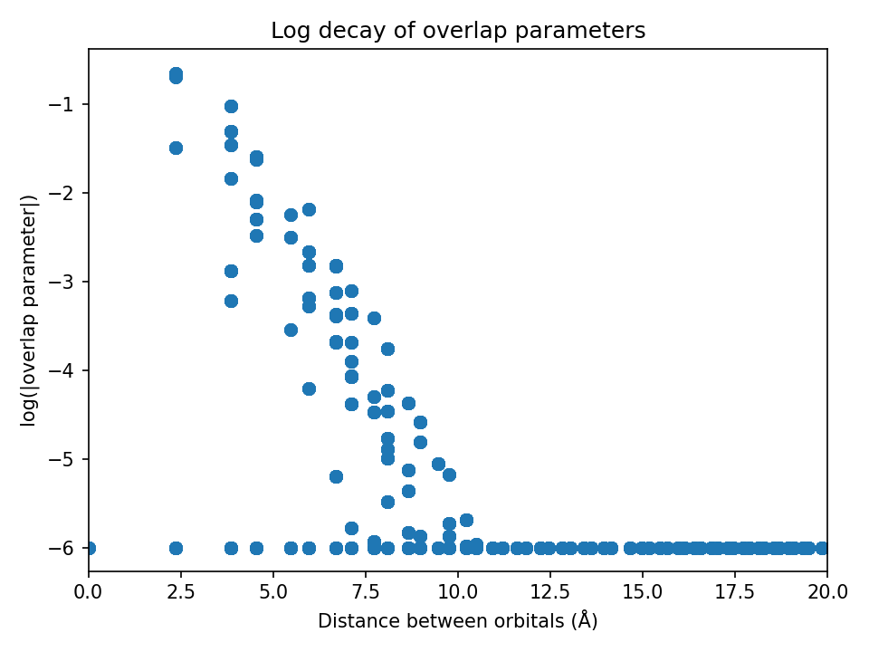

# COGITO Tutorials

These tutorials cover installing the COGITO code, running the main COGITO code, and analyzing bonding with
the COGITO tight binding model. The workflow below provides the general outline. Click the section labels to quickly get to each section.


## Installation

```bash
pip install --upgrade pip
pip install cogito-dft
```

To install optional dependences (scikit-image, dash, dash-ag-grid) that are used in some COGITOpost functions:

```bash
pip install "cogito-dft[plot]"
```

To avoid thread oversubscription and possible stalls **(especially on HPC)**, set:

```bash
export OMP_NUM_THREADS=1
```

## Standard Workflow

::::{grid} 1 3 6 6
:gutter: 0 

:::{grid-item-card} VASP
:link: tutorial.html#run-vasp
:link-type: url
:text-align: center
:class-card: d-flex align-items-center justify-content-center
<!--<span style="font-size:0.8em;">Save WAVECAR from static run with high NBANDS.</span>-->
:::

:::{grid-item}
:columns: 1
<div style="display:flex; align-items:center; justify-content:center; height:100%; font-size:1.5em;">→</div>
:::

:::{grid-item-card} COGITO
:link: tutorial.html#run-cogito
:link-type: url
:text-align: center
:class-card: d-flex align-items-center justify-content-center
<!--<span style="font-size:0.8em;">Adapt the atomic basis and make tight binding model.</span>-->
:::

:::{grid-item}
:columns: 1
<div style="display:flex; align-items:center; justify-content:center; height:100%; font-size:1.5em;">→</div>
:::

:::{grid-item-card} Check quality
:link: tutorial.html#analyze-quality-of-cogito-run
:link-type: url
:text-align: center
:class-card: d-flex align-items-center justify-content-center
<!--<span style="font-size:0.8em;">Get guidance on if COGITO run was successful.</span>-->
:::

:::{grid-item}
:columns: 1
<div style="display:flex; align-items:center; justify-content:center; height:100%; font-size:1.5em;">→</div>
:::

:::{grid-item-card} Gain chemical insight
:columns: 3
:link: tutorial.html#run-band-structure-class
:link-type: url
:text-align: center
:class-card: d-flex align-items-center justify-content-center
<!--<span style="font-size:0.8em;">Analyze orbital, COHP, or COOP projected quantites.</span>-->
:::

::::

## Run VASP

A couple things to keep in mind for the VASP calculation:

* Must be a static run (NSW=0)
* Use an irreducible grid (ISYM=1,2,3)
* Save the wavefunctions (LWAVE=True)
* Use more bands (NBANDS=(8-16)*natoms)
* No spin-orbit coupling (LSORBIT=False, but magnetism is supported (ISPIN=2)

## Run COGITO

Execute the main COGITO code that adapts the atomic orbital basis and calculates the corresponding Hamiltonian matrix.

COGITO reads the POSCAR, POTCAR, OUTCAR, vasprun.xml, and WAVECAR files from the VASP calculation.
For more on inputs and outputs of the main COGITO module, see [COGITO files](file_struc.md#cogito).

```{tab} bash (CLI)
~~~ bash
COGITO --dir "Si/"
~~~
```

```{tab} python
~~~ python
from COGITO_dft.COGITO import run_cogito

direct = "Si/"
run_cogito(directory=direct)
~~~
```

## Analyze quality of COGITO run

Checkes if quality output files are within expected range. If not, suggests tag changes that could improve quality. Run after COGITOpost for feedback on band interpolation quality. For more details, see [COGITOanalyze files](file_struc.md#cogitoanalyze).

```{tab} bash (CLI)
~~~ bash
COGITOanalyze --dir "Si/"
~~~
```

```{tab} python
~~~ python
from COGITO_dft.COGITOanalyze import analyze_all

direct = "Si/"
analyze_all(dir=direct)
~~~
```

## Study COGITO model

Obtain orbital, COHP, and/or COOP projected quantites.

To run the general model analysis:

```{tab} bash (CLI)
~~~ bash
COGITOpost --dir "Si/"
~~~
```

```{tab} python
~~~ python
from COGITO_dft.COGITOpost import run_cogito_model

direct = "Si/"
run_cogito_model(directory=direct)
~~~
```

This general analysis can be broken into 4 parts: **1)** Create class and plot decay of overlap/TB parameters, **2)** Check band interpolation error compared to DFT, **3)** Generation of atom and bond data, and **4)** Generation of the crystal bonds and/or combined bond and COHP projected density of states plots.

For discussion, here is how you could run them individually.

### 1) Create COGITO TB class object and check decay

Now we can work with our COGITO tight binding model. The first step is to verify the quality of the COGITO TB model.

```{tab} python
This code will need to be run before any use of the bandstructure or uniform classes.<br>

~~~ python
from COGITO_dft.COGITOpost import COGITO_TB_Model as CoTB

direct = "Si/"
# create TB class from a directory that has run COGITO
my_CoTB = CoTB(direct)
my_CoTB.normalize_params() # for precise normalization
# optionally, restrict the TB parameters to improve speed
my_CoTB.restrict_params(maximum_dist=15, minimum_value=0.00001)

# plot the overlap and hopping parameters to check decay
my_CoTB.plot_overlaps(my_CoTB) # generates overlaps_decay.png
my_CoTB.plot_hoppings(my_CoTB) # generates tbparams_decay.png
~~~
```

Note: The overlap and hopping plots should show a rough linear decay

<div style="display: flex; justify-content: center;">
    <div class="image-container">
        
    </div>
    <div class="image-container">
        
    </div>
</div>

### 2) Compare COGITO band energies to DFT

To verify the band interpolation of COGITO, the function 'compare_to_DFT' is used to determine the error between the interpolating COITO band energies and DFT band energies. The DFT energies are read from an EIGENVAL file from a VASP (band structure) calculation.

```{tab} bash (CLI)
~~~ bash
COGITOpost --dir "Si/" --eigfile 'EIGENVAL' --no_save_crystal_bonds --no_save_bondswCOHP --no_save_ico
~~~
```

```{tab} python
~~~ python
# the EIGENVAL file you want to compare to
eig_file = my_CoTB.directory + "EIGENVAL"
# generates compareDFT.png and DFT_band_error.txt
[band_dist, max_error, band_error] = my_CoTB.compare_to_DFT( my_CoTB, eig_file)
~~~
```

Metrics for the fit quality will be printed and written to the DFT_band_error.txt as below.

~~~ text
File generated by COGITO TB
average error in Valence Bands: 0.006377 eV
band distance in Valence Bands: 0.011352 eV
max error in valence band: 0.053859 eV
average error in Bottom 3 eV of CB: 0.017887 eV
average error in Conduc Bands: 0.357561 eV
~~~

<div style="display: flex; justify-content: center;">
    <div class="image-container">
        
    </div>
</div>

### 3) Generate atom and bond data

Create a uniform class object from the TB_Model class object. Then generate the json atom and bond data. These json files include every integrated quantity you may want to analyze! (Band structure or DOS analysis requires more effort.) 

```{tab} python
~~~ python
# now do the uniform stuff
from COGITO_dft.COGITOpost import COGITO_UNIFORM as CoUN
import numpy as np

density = 1.0 # increase for better DOS plots
new_grid = np.array(np.around(np.array(COGITOTB.num_trans) * densify, decimals=0),dtype=int)

my_CoUN = CoUN(COGITOTB, grid=new_grid) # create uniform class
my_CoUN.jsonify_bonddata()
~~~
```

### 4) Create interactive visualization of quantum bonds!

The accurate TB model from COGITO allows for calculation of COHP energies which accurately reflect the DFT energies.
This can be used to confidently and precisely trace back the crystal covalent bonding.

~~~ python
# plot the crystal structure with real bonds!
# if a bond energy magnitude is > energy_cutoff it will be plotted
# if the bond length is > bond_max it will not be plotted if an atom is outside the primitive cell
my_CoUN.get_bonds_figure(energy_cutoff=0.05,bond_max=3)
~~~

<div style="display: flex; justify-content: center;">
    <div class="image-container" style="height: 400px; width: 500px; background-color: transparent;">
        <iframe src="Si/crystal_bonds.html" style="transform: scale(0.75) translate(-40px, -40px); transform-origin: top left; width: 150%; height: 150%; border: 0;"></iframe>
    </div>
</div>

~~~ python
# plot the crystal bonds plot with an interative projected COHP!
my_CoUN.get_bonds_figure(energy_cutoff=0.05,bond_max=3)
~~~

<div style="display: flex; justify-content: center;">
    <div class="image-container" style="height: 400px; width: 500px; background-color: transparent;">
        <iframe src="PbO/bond_cohp_plot.html" style="transform: scale(0.75) translate(-40px, -40px); transform-origin: top left; width: 150%; height: 150%; border: 0;"></iframe>
    </div>
</div>


## Run band structure class

This class generates the band structure for high symmetry path determined with pymatgen. Importantly, this class
requires an instance of the tight binding class in initialization.

~~~ python
# must create TB class instance first
from COGITOpost import COGITO_TB_Model as CoTB
direct = "Si/"
my_CoTB = CoTB(direct) # create TB class from a directory that has run COGITO
my_CoTB.restrict_params(maximum_dist=15, minimum_value=0.00001) # restrict the TB parameters to improve speed

# now create band structure
from COGITOpost import COGITO_BAND as CoBS
my_CoBS = CoBS( my_CoTB, num_kpts = 10) # num_kpts is actually num per line, so set low
# optionally, plot band structure
my_CoBS.plotBS()
~~~

<span id="projectbs"></span>**Use COGITO for orbital projected band structure**<br>
Because COGITO forms a nearly complete basis for the charge density, we can accurately determine the percent of each
atomic orbital in the band wavefunction. Mulliken population analysis is used here to resolve the inherit ambiguity in assigning two-center terms to one orbital.

~~~ python
# plot the projected band structure of Si s orbitals
my_CoBS.get_projectedBS({"Si":["s"]})
~~~

<div style="display: flex; justify-content: center;">
    <div class="image-container" style="height: 500px; width: 500px;">
        <iframe src="Si/projectedBS.html" style="width: 100%; height: 95%; border: 0;"></iframe>
    </div>
</div>

<span id="cohpbs"></span>**Use COGITO for COHP/COOP projected band structure**<br>
The accurate TB model from COGITO allows for calculation of COHP energies which almost perfectly reflect the true DFT values.
This can be used to confidently and precisely trace back the crystal chemical origins of electronic structure!

Any COHP requires specifying two sets of orbitals. The bonds between any orbital in set 1 with any orbital in set 2 is included in end COHP.

~~~ python
# specify the two sets as a list of two dictionaries
# in the dictionary, the keys are elements, and the values are the orbitals included for that atom
# each dictionary can have multiple atoms as keys
orbs_dict = [{"Si":["s","p","d"]},{"Si":["s","p","d"]}] # for silicon
#orbs_dict = [{"Pb":["s","p","d"],"O":["s","p","d"]},{"Pb":["s","p","d"],"O":["s","p","d"]}] # for PbO
my_CoBS.get_COHP(orbs_dict)

# bonus points for running the interactive dash app
# this populates the autogenerates options for orbs_dict for the user to choose from
my_CoBS.make_COHP_dashapp()
~~~

<div style="display: flex; justify-content: center;">
    <div class="image-container" style="height: 500px; width: 500px;">
        <iframe src="Si/COHP_BS.html" style="width: 100%; height: 95%; border: 0;"></iframe>
    </div>
</div>

## Run uniform class

Last, but not least, this class works with a uniform grid of k-points. The uniform grid gives us access to integrated
properties like: atomic charge, covalent bond energy (ICOHP), projected density of states (DOS), etc.

Like the band structure class, the uniform class requires the input of a TB class instance.

~~~ python
# must create TB class instance first
from COGITOpost import COGITO_TB_Model as CoTB
direct = "Si/"
my_CoTB = CoTB(direct) # create TB class from a directory that has run COGITO
my_CoTB.restrict_params(maximum_dist=15, minimum_value=0.00001) # restrict the TB parameters to improve speed

# now create band structure
from COGITOpost import COGITO_UNIFORM as CoUN
my_CoUN = CoUN(COGITOTB,grid=(10,10,10))
my_CoUN.get_occupation()
~~~

Running the get_occupation function prints the output below. The first line shows how many electrons are in each orbital with Mulliken population analysis.
The second line 'sum' should be the total number of valence electrons. The third line is the electrons in each orbital without Mulliken.
The final line is the electrons for each atom with Mulliken population analysis.

~~~ text
Where are the electrons?
orbital + overlap occupation: [1.36334891 0.87881112 0.87891999 0.87891997 1.36334891 0.87881113 0.87891997 0.87892   ]
sum:  8.0
orbital occupation without bonds: [1.09389053 0.56850573 0.56864044 0.56864041 1.09389055 0.56850573 0.56864041 0.56864043]
The electron occupation for the atoms  ['Si' 'Si']  is  [3.99999999 4.00000001]
~~~

<span id="projectdos"></span>**Use COGITO for orbital/COHP/COOP projected DOS**<br>
Because COGITO forms a nearly complete basis for the charge density, we can accurately determine the percent of each
atomic orbital in the band wavefunction. Mulliken population analysis is used here to resolve the inherit ambiguity in assigning two-center terms to one orbital.

Any COHP requires specifying two sets of orbitals. The bonds between any orbital in set 1 with any orbital in set 2 is included in end COHP.

~~~ python
# Get orbital/element projected DOS for an element
my_CoUN.get_projectedDOS("Si",ylim=(-10,5),sigma=0.09) # sigma is gaussian smearing, adjust with initial k-grid

# specify the two sets as a list of two dictionaries
# in the dictionary, the keys are elements, and the values are the orbitals included for that atom
# each dictionary can have multiple atoms as keys
orbs_dict = [{"Si":["s","p","d"]},{"Si":["s","p","d"]}] # for silicon
#orbs_dict = [{"Pb":["s","p","d"],"O":["s","p","d"]},{"Pb":["s","p","d"],"O":["s","p","d"]}] # for PbO
my_CoUN.get_COHP(orbs_dict)
~~~

<div style="display: flex; justify-content: center">
    <div class="image-container" style="height: 400px;">
        
    </div>
    <div class="image-container" style="height: 400px;">
        
    </div>
</div>


