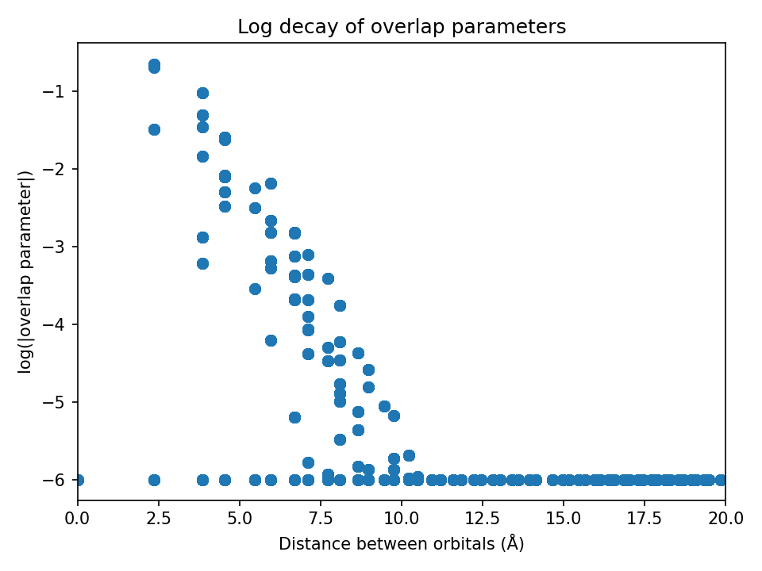
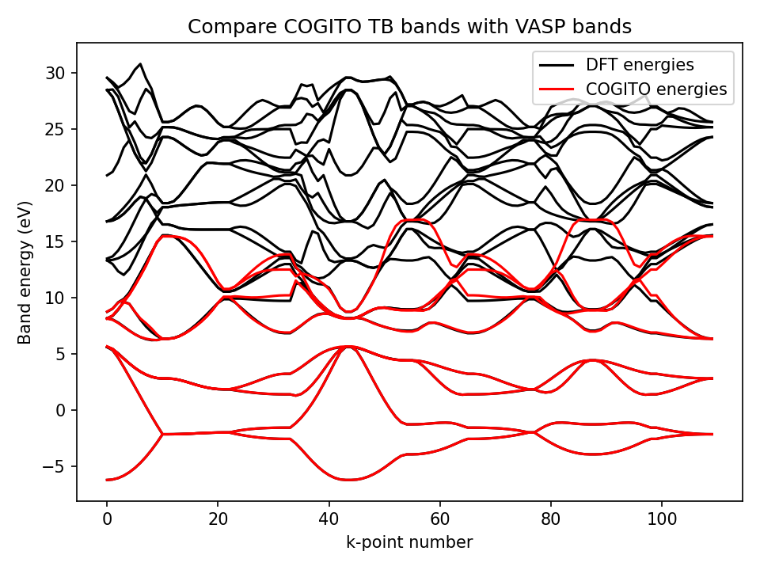
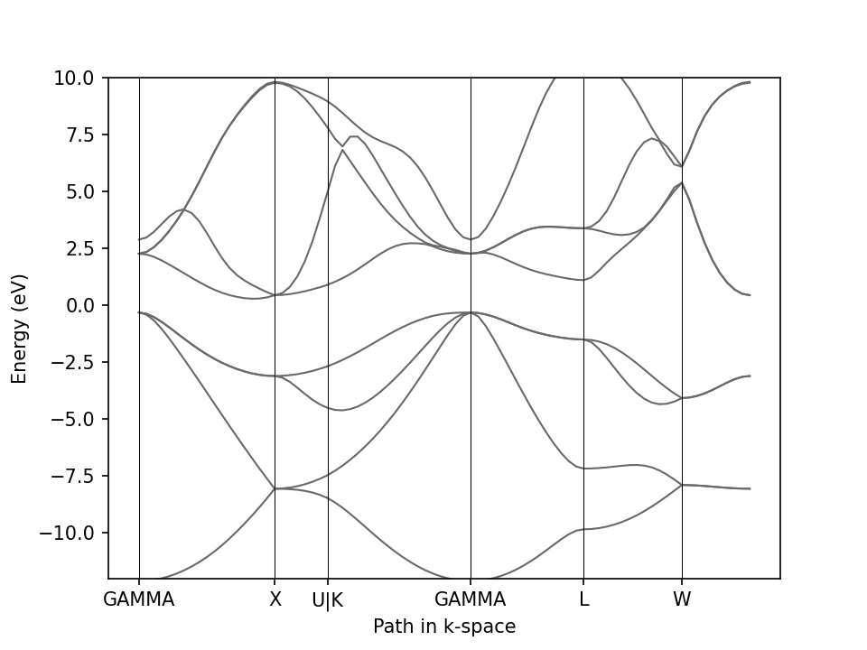

# COGITO Tutorials

These tutorials cover installing the COGITO code, running the main COGITO code, and analyzing bonding with
the COGITO tight binding model. The workflow below provides the general outline. Click the section labels to quickly get to each section.


## Installation

```{tab} bash
~~~ bash
pip install --upgrade pip
pip install cogito-dft
~~~
```

To install optional dependences (scikit-image, dash, dash-ag-grid) that are used in some COGITOpost functions:

```{tab} bash
~~~ bash
pip install "cogito-dft[plot]"
~~~
```

### Running on HPC

As of verison 0.3.2, compute heavy sections of COGITO.py are parallelized. Control the number of jobs and avoid thread oversubscription with the settings below. Modify `cpus-per-task` for optimal performance.

```{tab} bash
~~~ bash
#SBATCH -N 1
#SBATCH -n 1
#SBATCH --cpus-per-task=4

export OMP_NUM_THREADS=1
~~~
```

<br>

## Standard Workflow

::::{grid} 1 3 6 6
:gutter: 0 

:::{grid-item-card} VASP
:link: tutorial.html#run-vasp
:link-type: url
:text-align: center
:class-card: d-flex align-items-center justify-content-center
<!--<span style="font-size:0.8em;">Save WAVECAR from static run with high NBANDS.</span>-->
:::

:::{grid-item}
:columns: 1
<div style="display:flex; align-items:center; justify-content:center; height:100%; font-size:1.5em;">→</div>
:::

:::{grid-item-card} COGITO
:link: tutorial.html#run-cogito
:link-type: url
:text-align: center
:class-card: d-flex align-items-center justify-content-center
<!--<span style="font-size:0.8em;">Adapt the atomic basis and make tight binding model.</span>-->
:::

:::{grid-item}
:columns: 1
<div style="display:flex; align-items:center; justify-content:center; height:100%; font-size:1.5em;">→</div>
:::

:::{grid-item-card} Check quality
:link: tutorial.html#analyze-quality-of-cogito-run
:link-type: url
:text-align: center
:class-card: d-flex align-items-center justify-content-center
<!--<span style="font-size:0.8em;">Get guidance on if COGITO run was successful.</span>-->
:::

:::{grid-item}
:columns: 1
<div style="display:flex; align-items:center; justify-content:center; height:100%; font-size:1.5em;">→</div>
:::

:::{grid-item-card} Gain chemical insight
:columns: 3
:link: tutorial.html#generate-atom-and-bond-data
:link-type: url
:text-align: center
:class-card: d-flex align-items-center justify-content-center
<!--<span style="font-size:0.8em;">Analyze orbital, COHP, or COOP projected quantites.</span>-->
:::

::::

<br>

## Run VASP

A couple things to keep in mind for the VASP calculation:

* Must be a static run (NSW=0)
* Use an irreducible grid (ISYM=1,2,3)
* Save the wavefunctions (LWAVE=True)
* Use more bands (NBANDS=(12-20)*natoms)
* No spin-orbit coupling (LSORBIT=False, but magnetism is supported (ISPIN=2)

<br>

## Run COGITO

Execute the main COGITO code that adapts the atomic orbital basis and calculates the corresponding Hamiltonian matrix.

COGITO reads the POSCAR, POTCAR, OUTCAR, vasprun.xml, and WAVECAR files from the VASP calculation.
For more on inputs and outputs of the main COGITO module, see [COGITO files](file_struc.md#cogito).

```{tab} bash (CLI)
~~~ bash
COGITO --dir "Si/"
~~~
```

```{tab} python
~~~ python
from COGITO_dft.COGITO import run_cogito

direct = "Si/"
run_cogito(directory=direct)
~~~
```

<br>

## Analyze quality of COGITO run

Checkes if quality output files are within expected range. If not, suggests tag changes that could improve quality. Run after COGITOpost for feedback on band interpolation quality. The 'WARNING' tolerances are set low, so rerunning is often not neccessary. For "ERROR" messages follow advice and/or email Emily. For more details, see [COGITOanalyze files](file_struc.md#cogitoanalyze).

```{tab} bash (CLI)
~~~ bash
COGITOanalyze --dir "Si/"
~~~
```

```{tab} python
~~~ python
from COGITO_dft.COGITOanalyze import analyze_all

direct = "Si/"
analyze_all(dir=direct)
~~~
```

<br>

## Study COGITO model

To run the general tight binding model analysis:

```{tab} bash (CLI)
~~~ bash
COGITOpost --dir "Si/"
~~~
```

```{tab} python
~~~ python
from COGITO_dft.COGITOpost import run_cogito_model

direct = "Si/"
run_cogito_model(directory=direct)
~~~
```

This general analysis can be broken into 4 parts: **1)** Create class and plot decay of overlap/TB parameters, **2)** Check band interpolation error compared to DFT, **3)** Generate integrated atom and bond projected data, and **4)** Generate the crystal bonds and/or combined bond and COHP projected density of states plots.

For a better understanding of the structure of the data, review Section VI of the [COGITO manuscript](https://arxiv.org/pdf/2511.19725).

These 4 parts can be selected separately or customized with tags in command line interface or run in python individually, as reviewed below. 
For more a detailed analysis on density of states (uniform k-grid) or band structue, see [below](tutorial.md#additional-analysis), explore [COGITOpost files](file_struc.md#cogitopost), or reference the API/source code.

<br>

### 1) Create COGITO TB class object and check decay

Now we can work with our COGITO tight binding model. The first step is to verify the quality of the COGITO TB model.

```{tab} python
Important! This code will need to be run before any use of the bandstructure or uniform classes.<br>

~~~ python
from COGITO_dft.COGITOpost import COGITO_TB_Model as CoTB

direct = "Si/"
# create TB class from a directory that has run COGITO
my_CoTB = CoTB(direct)
my_CoTB.normalize_params() # for precise normalization
# restrict the TB parameters to improve speed
my_CoTB.restrict_params(maximum_dist=15, minimum_value=0.00001)

# optionally, plot the overlap and hopping parameters to check decay
my_CoTB.plot_overlaps(my_CoTB) # generates overlaps_decay.png
my_CoTB.plot_hoppings(my_CoTB) # generates tbparams_decay.png
~~~
```

Note: The overlap and hopping plots should show a rough linear decay

<div style="display: flex; justify-content: center;">
    <div class="image-container">
        
    </div>
    <div class="image-container">
        
    </div>
</div>

<br>

### 2) Compare COGITO band energies to DFT

To verify the band interpolation of COGITO, the function `compare_to_DFT` is used to determine the error between the interpolating COITO band energies and DFT band energies. The DFT energies are read from an EIGENVAL file from a VASP (band structure) calculation.

```{tab} bash (CLI)
~~~ bash
COGITOpost --dir "Si/" --eigfile 'EIGENVAL' --no_save_crystal_bonds --no_save_bondswCOHP --no_save_ico
~~~
```

```{tab} python
~~~ python
# the EIGENVAL file you want to compare to
eig_file = my_CoTB.directory + "EIGENVAL"
# generates compareDFT.png and DFT_band_error.txt
[band_dist, max_error, band_error] = CoTB.compare_to_DFT( my_CoTB, eig_file)
~~~
```

Metrics for the fit quality will be printed and written to the DFT_band_error.txt as below.

~~~ text
File generated by COGITO TB
average error in Valence Bands: 0.006377 eV
band distance in Valence Bands: 0.011352 eV
max error in valence band: 0.053859 eV
average error in Bottom 3 eV of CB: 0.017887 eV
average error in Conduc Bands: 0.357561 eV
~~~

<div style="display: flex; justify-content: center;">
    <div class="image-container">
        
    </div>
</div>

<br>

### 3) Generate atom and bond data
 
By paritioning integrated values (like charge and band energy) into atom and bond contributions, we generate three json data files. These json files contain almost everything you may want to analyze! (Band structure or DOS analysis requires additional effort, see below.)  To automatically visualize and interact with this atom and bond data, see Step 4!

In the future, I will develop a more thorough tutorial of these files with examples of how to use them, but for now reference [COGITOpost files](file_struc.md#cogitopost), examine the files yourself, and email me (Emily) with any questions.

```{tab} bash (CLI)
~~~ bash
COGITOpost --dir "Si/" --densify 1.0  --no_save_quality_info --no_save_crystal_bonds --no_save_bondswCOHP --no_save_ico
~~~
```

```{tab} python
~~~ python
# first, make an object of the uniform class
from COGITO_dft.COGITOpost import COGITO_UNIFORM as CoUN
import numpy as np

densify = 1.0 # increase for better sampling on DOS plots
new_grid = np.array(np.around(np.array(my_CoTB.num_trans) * densify, decimals=0),dtype=int)
# new_grid = [10,10,10] # can also just set manually

my_CoUN = CoUN(my_CoTB, grid=new_grid) # create uniform class
min_cohp = 0.00001 # adjust to include more or less bonds in json data
my_CoUN.jsonify_bonddata(minimum_cohp=min_cohp)
~~~
```

<br>

### 4) Create interactive visualization of quantum bonds!

Because COGITO is atomic, adaptable to DFT, and accurate, we can calculate COHP energies that fully describe the DFT energies.
This can be used to confidently and precisely trace the covalent bonding origins of compound stability.

COGITO creates interactive html files to quickly study bonding data. In the plot below, the width of each bonds conveys the magnitude of the bond energy. Bonds are solid while antibonds are dashed. Hover over bonds to see orbital-decomposed COHP bond energies, bond charge, and bond magnetic moment. Hover over the atoms (in `get_bonds_charge_figure` versions) to see atom charge and magnetic moment.

```{tab} bash (CLI)
~~~ bash
COGITOpost --dir "Si/" --energy_cutoff 0.05 --bond_max 3 --auto_label 'mulliken' --no_save_quality_info --no_save_bondswCOHP --no_save_ico
~~~
```

```{tab} python
~~~ python
# plot the crystal structure with real bonds!
# if a bond energy magnitude is > energy_cutoff it will be plotted
# if the bond length is > bond_max it will not be plotted if an atom is outside the primitive cell
my_CoUN.get_bonds_charge_figure(energy_cutoff=0.05, bond_max=3, auto_label="mulliken")
~~~
```

<div style="display: flex; justify-content: center;">
    <div class="image-container" style="height: 400px; width: 500px; background-color: transparent;">
        <iframe src="Si/crystal_bonds.html" style="transform: scale(0.75) translate(-40px, -40px); transform-origin: top left; width: 150%; height: 150%; border: 0;"></iframe>
    </div>
</div>

Want information on where the bonds are in electron energy space? Below is just that. Hover over a bond and the related bond COHP-projected density of states will appear on the right plot! The colors further breakdown the contribution of each orbital interactions across electron energy.

```{tab} bash (CLI)
Note: It often good to set densify >1.0 for the COHP-projected density of states plot.
~~~ bash
COGITOpost --dir "PbO/" --densify 1.5 --energy_cutoff 0.05 --bond_max 3 --auto_label 'full' --no_save_quality_info --no_save_crystal_bonds --no_save_ico
~~~
```

```{tab} python
Note: It often good to set densify >1.0 for the COHP-projected density of states plot.
~~~ python
# plot the crystal bonds plot with an interative  COHP-projected DOS!
my_CoUN.get_crystal_plus_COHP(energy_cutoff=0.05, bond_max=3, auto_label="full")
~~~
```

<div style="display: flex; justify-content: center;">
    <div class="image-container" style="height: 400px; width: 500px; background-color: transparent;">
        <iframe src="PbO/bond_cohp_plot.html" style="transform: scale(0.75) translate(-40px, -40px); transform-origin: top left; width: 150%; height: 150%; border: 0;"></iframe>
    </div>
</div>

<br>

## Additional Analysis

For specific queries on orbital-projected or orbital-interaction-projected density of states and band structure, COGITO provides several resources. Simple examples of these are in the tutorials below. 

**Extra info on code structure and variables:** The plotting or data-return functions in `COGITO_UNIFORM` and `COGITO_BAND` are based on either the `get_COHP` or `get_orbprojs` functions in `COGITO_TB_Model`. The orbital-interaction (COHP/COOP) functions require specifying two sets of orbitals and the distance of interaction between them. The function `filter_all_indices` returns all indices of the 5D matrices that is between an orbital in set 1 with an orbital in set 2 that also satisfy the nearest neighbor (`NN`) type (or newly, the `min_dist` and `max_dist`). The function `atmorb_dict_to_ind` returns the specific orbital indices that satisfy the flexible orbital dictionary passed to COHP/COOP/orbital-projected BS/DOS functions. For orbital-projected quantities, Mulliken population analysis can be used to resolve the inherit ambiguity in assigning two-center terms to one orbital.

### Orbital, COHP, or COOP projected DOS
For a smoother DOS plot, increase densify (Note: nkpts and time scales cubically with densify) or increase sigma (can smear separate states together if too large).

```{tab} python
~~~ python
# make the unifom class object
from COGITO_dft.COGITOpost import COGITO_UNIFORM as CoUN
import numpy as np
densify = 1.0 # increase for better sampling on DOS plots
new_grid = np.array(np.around(np.array(my_CoTB.num_trans) * densify, decimals=0),dtype=int)
my_CoUN = CoUN(my_CoTB, grid=new_grid) # create uniform class

# Get orbital/element projected DOS for an element
my_CoUN.get_projectedDOS("Si",ylim=(-10,5),sigma=0.09) # sigma is gaussian smearing, adjust with initial k-grid

# specify the two sets as a list of two dictionaries
# in the dictionary, the keys are elements, and the values are the orbitals included for that atom
# each dictionary can have multiple atoms as keys, example for PbO
# orbs_dict = [{"Pb":["s","p","d"],"O":["s","p","d"]},{"Pb":["s","p","d"],"O":["s","p","d"]}]
# alternatively, list the orbital indices that you want to include (get from all_bonds.json)
# orbs_dict = [[0,1,2,3],[4,5,6,7]] # include bonds between the first silicon atom and second silicon atom

orbs_dict = [{"Si":["s","p","d"]},{"Si":["s","p","d"]}] # for silicon
CoUN.get_COHP_DOS(my_CoUN, orbs_dict, NN='All')
~~~
```

<div style="display: flex; justify-content: center">
    <div class="image-container" style="height: 400px;">
        
    </div>
    <div class="image-container" style="height: 400px;">
        
    </div>
</div>

### Generate and project on band structure

This class generates the band structure with a variety of options for specifying kpath, see `COGITO_BAND.get_bandstructure` in the api for more details. 

1. In only `line_density` is passed, the high symmetry path is determined with pymatgen and seekpath. 
2. If `high_sym_kpnts` is passed, these k-points with `line_density` will be used to make the final k-points list (`high_sym_kpath` can optionally be passed). 
3. If `all_kpts` is passed, this will be used as the final k-points list (`kpt_labels` can optionally be passed).

```{tab} python
Note: This class requires an instance of the tight binding class to initialize.
~~~ python
# ensure TB class object is made
from COGITO_dft.COGITOpost import COGITO_TB_Model as CoTB
direct = "Si/"
my_CoTB = CoTB(direct) # create class from directory
my_CoTB.normalize_params() # for precise normalization
my_CoTB.restrict_params(maximum_dist=15, minimum_value=0.00001)

# now create band structure
from COGITO_dft.COGITOpost import COGITO_BAND as CoBS
my_CoBS = CoBS(my_CoTB, line_density = 10) # line_density is num kpts per line segment, so set low
# plot band structure
my_CoBS.plotBS() # or plotlyBS()
~~~
```

<div style="display: flex; justify-content: center">
    <div class="image-container" style="height: 400px;">
        
    </div>
</div>

<span id="projectbs"></span>**Use COGITO for orbital projected band structure**<br>
Because COGITO forms a nearly complete basis for the DFT wavefunctions and the band structure below is directly from tight binding, the sum of projections is guaranteed to be 1! (That is, when Mulliken population analysis is used to resolve the inherit ambiguity in assigning two-center terms to one orbital. Otherwise, bond populations need to be included in the sum.)

```{tab} python
~~~ python
# plot the projected band structure of Si s orbitals
CoBS.plot_projectedBS(my_CoBS, {"Si":["s"]})
~~~
```

<div style="display: flex; justify-content: center;">
    <div class="image-container" style="height: 500px; width: 500px;">
        <iframe src="Si/projectedBS.html" style="width: 100%; height: 95%; border: 0;"></iframe>
    </div>
</div>

<span id="cohpbs"></span>**Use COGITO for COHP/COOP projected band structure**<br>
The accurate TB model from COGITO allows for calculation of COHP energies which almost perfectly reflect the true DFT values.
This can be used to confidently and precisely trace back the crystal chemical origins of electronic structure!

Any COHP requires specifying two sets of orbitals. The bonds between any orbital in set 1 with any orbital in set 2 at the defined distance apart is included in resulting COHP.

```{tab} python
~~~ python
# specify the two sets as a list of two dictionaries
# in the dictionary, the keys are elements, and the values are the orbitals included for that atom
# each dictionary can have multiple atoms as keys, example for PbO
# orbs_dict = [{"Pb":["s","p","d"],"O":["s","p","d"]},{"Pb":["s","p","d"],"O":["s","p","d"]}]
# alternatively, list the orbital indices that you want to include (get from all_bonds.json)
# orbs_dict = [[0,1,2,3],[4,5,6,7]] # include bonds between the first silicon atom and second silicon atom

orbs_dict = [{"Si":["s","p","d"]},{"Si":["s","p","d"]}] # for silicon
CoBS.plot_COHP(my_CoBS, orbs_dict, NN='All')

# bonus points for running the interactive dash app
# this populates the autogenerates options for orbs_dict for the user to choose from
CoBS.make_COHP_dashapp(my_CoBS)
~~~
```

<div style="display: flex; justify-content: center;">
    <div class="image-container" style="height: 500px; width: 500px;">
        <iframe src="Si/COHP_BS.html" style="width: 100%; height: 95%; border: 0;"></iframe>
    </div>
</div>

<br>

### Export to pymatgen objects

COGITO can export its orbital projection results as pymatgen objects, giving access to pymatgen's electronic-structure plotting and analysis. However, selection of specific orbital types (e.g. 'px' or 'dxy') will not correct. This is because COGITO uses the local environment to define each orbital as a linear combination of all 2l+1 spherical harmonics such that COGITO is invariant to arbitrary coordinate changes. This combination is found in the "orbital spherical harmonics combo" section of tb_input.txt.

Pymatgen objects for COHP/COOP analysis are not available for output (the number of added Cohp objects would be infeasible, and I prefer the speed and selection abilities of get_COHP/COOP() based methods in COGITOpost or integrated value analysis with COGITO's bond json files).

**Projected DOS via pymatgen**<br>
The function `get_pymatgen_completedos` returns a pymatgen `CompleteDos` object built from the COGITO orbital projections. This can be passed directly to pymatgen's `DosPlotter` for spd-projected or element-projected DOS plots.

```{tab} python
~~~ python
from COGITO_dft.COGITOpost import COGITO_UNIFORM as CoUN
from pymatgen.electronic_structure.plotter import DosPlotter
import matplotlib.pyplot as plt
import numpy as np

densify = 1.0 # increase for better sampling on DOS plots
new_grid = np.array(np.around(np.array(my_CoTB.num_trans) * densify, decimals=0), dtype=int)
my_CoUN = CoUN(my_CoTB, grid=new_grid)

# returns a pymatgen CompleteDos object
cogito_dos = CoUN.get_pymatgen_completedos(my_CoUN)

# example plotting
plotter = DosPlotter(zero_at_efermi=True, sigma=0.05)
plotter.add_dos("Total", cogito_dos)
plotter.add_dos_dict(cogito_dos.get_spd_dos())

ax = plotter.get_plot(xlim=(-10, 10))
plt.show()
~~~
```

**Projected band structure via pymatgen**<br>
The function `get_pymatgen_bandstruc` in both uniform and bandstructure COGITO classes returns a pymatgen `BandStructureSymmLine` object with COGITO orbital projections attached. This can be passed to pymatgen's `BSPlotterProjected` for customizable projected band structure plots.

```{tab} python
~~~ python
from COGITO_dft.COGITOpost import COGITO_BAND as CoBS
from pymatgen.electronic_structure.plotter import BSPlotterProjected
import matplotlib.pyplot as plt

my_CoBS = CoBS(my_CoTB, line_density=50)

# returns a pymatgen BandStructureSymmLine object with COGITO projections
cogito_bs = CoBS.get_pymatgen_bandstruc(my_CoBS)

# example plotting
plotter = BSPlotterProjected(cogito_bs)
axes = plotter.get_projected_plots_dots({"Si": ["s"]}, ylim=(-10, 10))

figure = axes[0].figure
plt.show()
~~~
```

